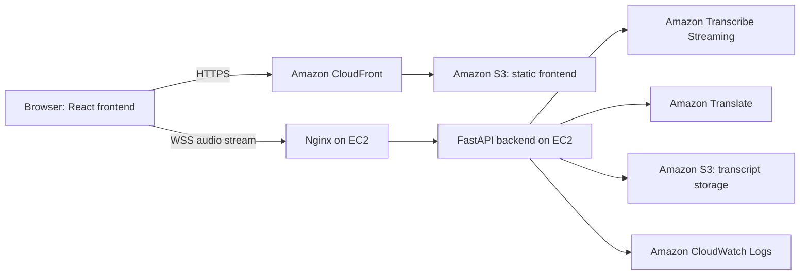

# Workshop Overview

## Problem

In bilingual workshops and meetings, participants may miss information because the speaker uses a language they are less comfortable with, speaks quickly, or changes language during the session. Manual note-taking is slow and does not provide real-time support.

LiveCap solves this by creating a browser-based captioning tool that converts speech to text, translates between Vietnamese and English, shows captions live, and stores exported transcripts in AWS.

## Goals

- Capture microphone audio directly in the browser.
- Stream audio to a backend using WebSocket.
- Generate near-real-time captions with Amazon Transcribe Streaming.
- Translate finalized segments with Amazon Translate.
- Display Vietnamese captions on the left and English captions on the right.
- Export TXT transcripts to Amazon S3 and return pre-signed download links.
- Record operational events and integration errors with CloudWatch logging.

## High-Level Architecture

## AWS Services Used

| Service | Role in LiveCap | Why it was chosen |
| --- | --- | --- |
| Amazon EC2 | Hosts the FastAPI backend and WebSocket process | A persistent server fits long-lived real-time WebSocket audio streams |
| Amazon S3 | Hosts frontend files and stores exported TXT transcripts | Low-cost durable object storage |
| Amazon CloudFront | Serves the frontend globally over HTTPS | Improves performance and provides HTTPS delivery for static assets |
| Amazon Transcribe Streaming | Converts live audio into text | Managed real-time speech-to-text with speaker diarization support |
| Amazon Translate | Translates finalized captions between Vietnamese and English | Managed translation service with simple API integration |
| Amazon CloudWatch | Stores structured logs and integration errors | Required for monitoring and troubleshooting |
| IAM | Controls EC2 access to AWS services | Avoids hard-coded credentials and supports least privilege |

## Data Flow

1. User opens the frontend through CloudFront.
2. Browser requests microphone permission.
3. Frontend opens a WSS connection to the backend.
4. Audio chunks are sent from the browser to FastAPI.
5. FastAPI forwards audio to Amazon Transcribe Streaming.
6. Finalized transcript segments are translated with Amazon Translate.
7. Captions are sent back to the browser and displayed in two columns.
8. User exports a session transcript.
9. Backend uploads TXT output to S3 and returns a pre-signed download URL.
10. Logs are written to CloudWatch for session events and AWS integration errors.

## MVP Scope

The MVP intentionally does not include user authentication, meeting platform integration, speaker identity recognition, multi-room support, language selection beyond Vietnamese-English, or AI summarization. These features are useful, but they would increase scope beyond a one-student bootcamp project.

