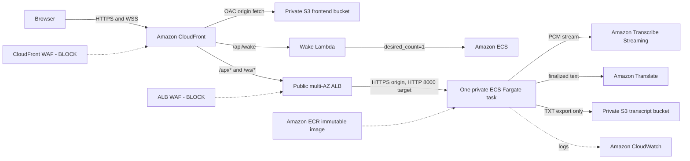

# Workshop Overview

## Problem and Goals

Language barriers and fast-paced speech make bilingual meetings difficult to
follow. LiveCap provides near-real-time captions without requiring a meeting
platform integration or storing microphone recordings.

The implemented MVP can:

- capture browser microphone audio as 16 kHz, 16-bit, mono PCM;
- stream audio through a secure WebSocket;
- transcribe Vietnamese and English with parallel Transcribe streams;
- translate only finalized segments and append only finalized caption rows;
- preserve finalized rows across bounded reconnects;
- enforce a 30-minute session limit and process-local abuse limits; and
- export finalized bilingual transcripts as TXT through a presigned S3 URL.

## Verified As-Deployed Architecture

The backend runs in `ap-southeast-1` inside dedicated VPC `10.20.0.0/16`. The
ALB spans public subnets in `ap-southeast-1a` and `ap-southeast-1b`; the ECS task
runs without a public IP in private subnets and uses one NAT Gateway in `1a` for
outbound traffic. ECS can replace a failed task, but there is no active-active
backend; an in-flight WebSocket session is lost when the task is replaced.

## Services and Responsibilities

| Service | Responsibility in LiveCap |
| --- | --- |
| CloudFront | Public HTTPS/WSS entrypoint and path routing |
| AWS WAF | Blocks managed threats and rate abuse at CloudFront and ALB |
| Lambda | Wakes the target ECS service from zero before capture |
| Amazon S3 | Private frontend origin and private TXT transcript storage |
| ALB | Health checks and forwarding API/WebSocket traffic to port 8000 |
| ECS Fargate | Runs the containerized FastAPI backend |
| Amazon ECR | Stores backend images under immutable SHA-derived tags |
| Amazon Transcribe | Converts streaming PCM audio to partial/final text |
| Amazon Translate | Translates finalized text between English and Vietnamese |
| CloudWatch | Receives application logs and AWS service metrics |
| GitHub Actions | Runs validation-only CI without deploying |

## Main Runtime Flow

1. CloudFront serves the React/Vite frontend from private S3 through OAC.
2. Start calls `/api/wake` through CloudFront OAC to Lambda.
3. The frontend polls `/api/health`, requests microphone access, then opens `/ws/transcribe`.
4. FastAPI checks global and per-IP session limits before starting AWS streams.
5. PCM chunks are sent only while the socket is open.
6. Transcribe returns partial and finalized text; only finalized segments are
   translated and appended to the transcript.
7. Bilingual captions return over Fargate -> ALB -> CloudFront -> browser.
8. Export writes a TXT object to private S3 and returns a temporary URL.

## Post-Cutover Status

The dedicated VPC, private Fargate service, HTTPS target ALB, NAT Gateway, two
blocking WAFs, wake Lambda, CloudWatch dashboard, and AWS Budget are deployed.
CloudFront routes API and WebSocket traffic to the target stack. The controlled
`0 -> 1` wake test passed; automatic idle scale-down remains disabled during
the rollback window. The legacy stack has not been deleted.

