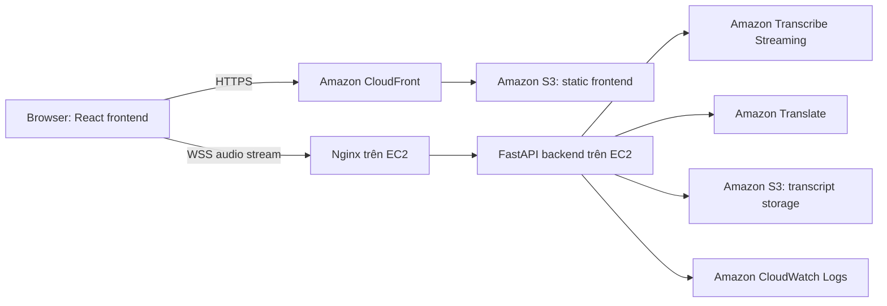

# Tổng quan workshop

## Vấn đề

Trong workshop và cuộc họp song ngữ, người tham gia có thể bỏ lỡ nội dung vì diễn giả dùng ngôn ngữ họ chưa thật sự quen, nói nhanh, hoặc chuyển đổi giữa tiếng Việt và tiếng Anh. Ghi chú thủ công chậm và không hỗ trợ theo thời gian thực.

LiveCap giải quyết vấn đề này bằng một công cụ caption trên trình duyệt: chuyển lời nói thành văn bản, dịch Việt-Anh, hiển thị caption trực tiếp và lưu transcript export trên AWS.

## Mục tiêu

- Thu âm trực tiếp từ microphone trong trình duyệt.
- Stream audio đến backend bằng WebSocket.
- Tạo caption gần thời gian thực với Amazon Transcribe Streaming.
- Dịch finalized segment bằng Amazon Translate.
- Hiển thị caption tiếng Việt ở cột trái và tiếng Anh ở cột phải.
- Export transcript TXT lên Amazon S3 và trả về pre-signed download link.
- Ghi operational event và lỗi tích hợp bằng CloudWatch logging.

## Kiến trúc tổng quan

## Dịch vụ AWS sử dụng

| Dịch vụ | Vai trò trong LiveCap | Lý do chọn |
| --- | --- | --- |
| Amazon EC2 | Chạy FastAPI backend và WebSocket process | Server persistent phù hợp với WebSocket audio stream dài |
| Amazon S3 | Host frontend file và lưu TXT transcript export | Object storage bền vững, chi phí thấp |
| Amazon CloudFront | Phân phối frontend qua HTTPS | Tăng hiệu năng và cung cấp HTTPS cho static asset |
| Amazon Transcribe Streaming | Chuyển audio live thành văn bản | Dịch vụ speech-to-text managed, hỗ trợ real-time và diarization |
| Amazon Translate | Dịch caption finalized giữa tiếng Việt và tiếng Anh | Dịch vụ managed, dễ tích hợp qua API |
| Amazon CloudWatch | Lưu structured log và lỗi tích hợp | Cần cho monitoring và troubleshooting |
| IAM | Kiểm soát quyền EC2 gọi AWS services | Tránh hard-code credential và hỗ trợ least privilege |

## Luồng dữ liệu

1. Người dùng mở frontend qua CloudFront.
2. Browser xin quyền microphone.
3. Frontend mở kết nối WSS đến backend.
4. Audio chunk được gửi từ browser đến FastAPI.
5. FastAPI chuyển audio đến Amazon Transcribe Streaming.
6. Finalized transcript segment được dịch bằng Amazon Translate.
7. Caption được gửi về browser và hiển thị theo hai cột.
8. Người dùng export transcript của session.
9. Backend upload TXT output lên S3 và trả về pre-signed download URL.
10. Log được ghi vào CloudWatch cho session event và lỗi tích hợp AWS.

## Phạm vi MVP

MVP không bao gồm xác thực người dùng, tích hợp meeting platform, nhận diện danh tính speaker, multi-room, chọn ngôn ngữ ngoài Việt-Anh, hoặc AI summarization. Các tính năng này hữu ích nhưng sẽ vượt quá phạm vi đồ án bootcamp của một học viên.

